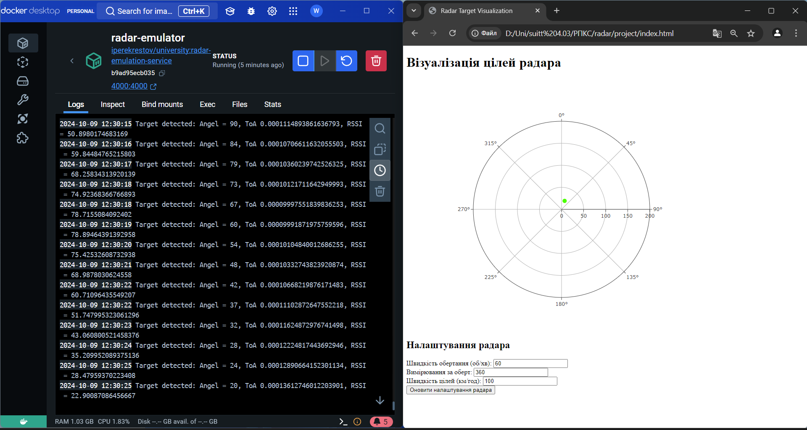
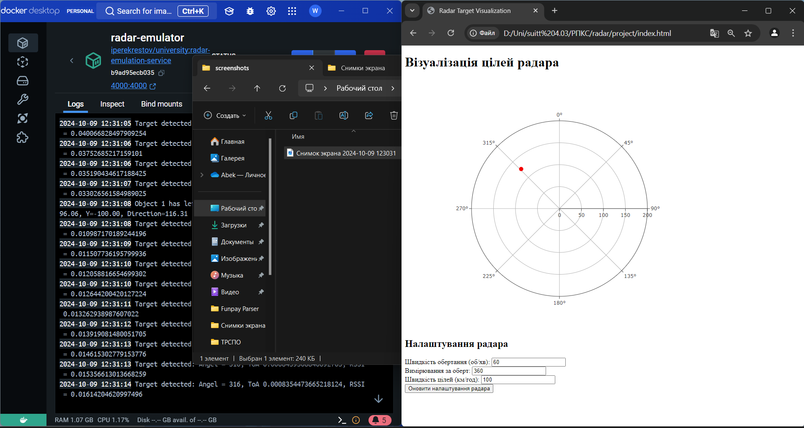

# Розробка додатку для візуалізації вимірювань радару
## Мета роботи
### Розробити додаток, який зчитує дані з емульованої вимірювальної частини радару, наданої у вигляді Docker image, та відображає задетектовані цілі на графіку в полярних координатах.

## Код
```javascript
// Підключення до WebSocket сервера
const socket = new WebSocket('ws://localhost:4000')

// Функція для обчислення відстані на основі часу затримки сигналу
function calculateDistance(time) {
	const speedOfLight = 300000 // км/с
	return (time * speedOfLight) / 2 // Двосторонній шлях
}

// Функція для оновлення графіку
function updatePlot(scanAngle, echoResponses) {
	const distances = echoResponses.map(response =>
		calculateDistance(response.time)
	)
	const powers = echoResponses.map(response => response.power)

	if (distances.length > 0) {
		// Берем только последние значения для отображения
		const r = [distances[distances.length - 1]]
		const theta = [scanAngle] // Отображаем текущий угол
		const markerColors = [powers[powers.length - 1]] // Цвет только последней точки

		// Обновление полярного графика
		Plotly.restyle('radar-plot', {
			r: [r],
			theta: [theta],
			'marker.color': [
				markerColors.map(
					power => `rgba(${255 - power * 255}, ${power * 255}, 0, 1)`
				),
			],
		})
	}
}
// Налаштування події відкриття WebSocket з'єднання
socket.onopen = () => {
	console.log('Connected to WebSocket server')
}

// Налаштування події отримання повідомлень від WebSocket сервера
socket.onmessage = event => {
	const data = JSON.parse(event.data)
	const scanAngle = data.scanAngle
	const echoResponses = data.echoResponses

	// Відображення на графіку
	updatePlot(scanAngle, echoResponses)
}

// Налаштування події закриття WebSocket з'єднання
socket.onclose = () => {
	console.log('WebSocket connection closed')
}

// Налаштування події помилки WebSocket
socket.onerror = error => {
	console.error('WebSocket error:', error)
}

// Ініціалізація полярного графіку
Plotly.newPlot(
	'radar-plot',
	[
		{
			r: [],
			theta: [],
			mode: 'markers',
			marker: {
				color: [],
				size: 10,
			},
			type: 'scatterpolar',
		},
	],
	{
		polar: {
			radialaxis: {
				range: [0, 200], // Дальність радара у км
			},
			angularaxis: {
				direction: 'clockwise',
				rotation: 90, // Початок осі з 90 градусів
			},
		},
		showlegend: false,
	}
)

// Функція для оновлення конфігурації радара через API
function updateRadarConfig() {
	const rotationSpeed = document.getElementById('rotationSpeed').value
	const measurementsPerRotation = document.getElementById(
		'measurementsPerRotation'
	).value
	const targetSpeed = document.getElementById('targetSpeed').value

	fetch('http://localhost:4000/config', {
		method: 'PUT',
		headers: {
			'Content-Type': 'application/json',
		},
		body: JSON.stringify({
			rotationSpeed: parseInt(rotationSpeed),
			measurementsPerRotation: parseInt(measurementsPerRotation),
			targetSpeed: parseInt(targetSpeed),
		}),
	})
		.then(response => response.json())
		.then(data => {
			console.log('Radar config updated:', data)
		})
		.catch(error => {
			console.error('Error updating radar config:', error)
		})
}

```

## Результат роботи




